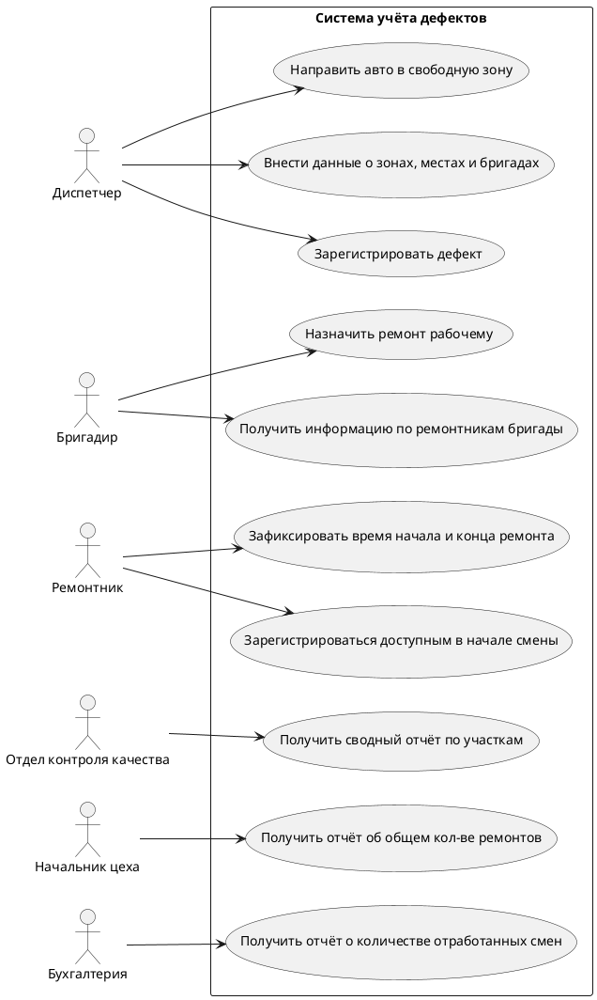
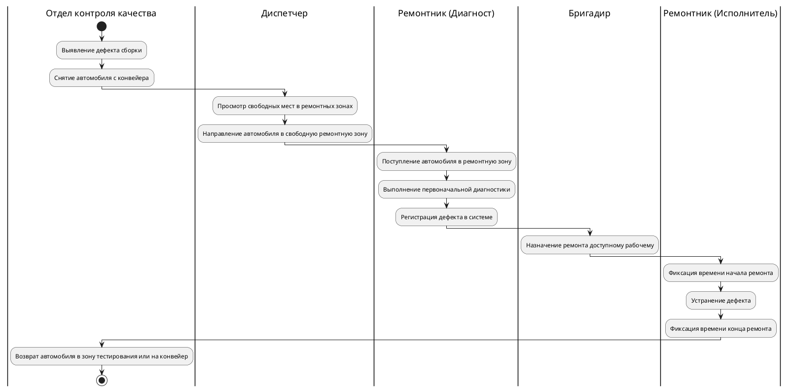
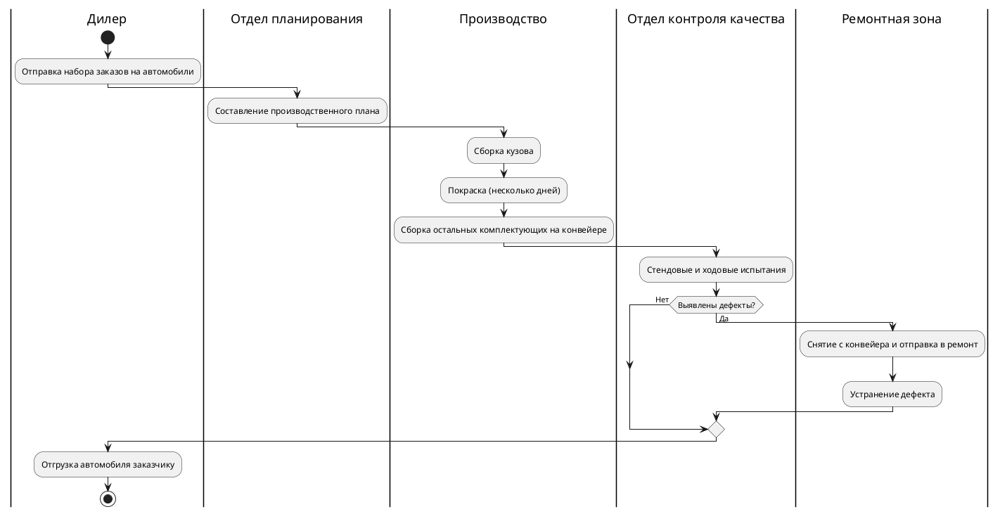
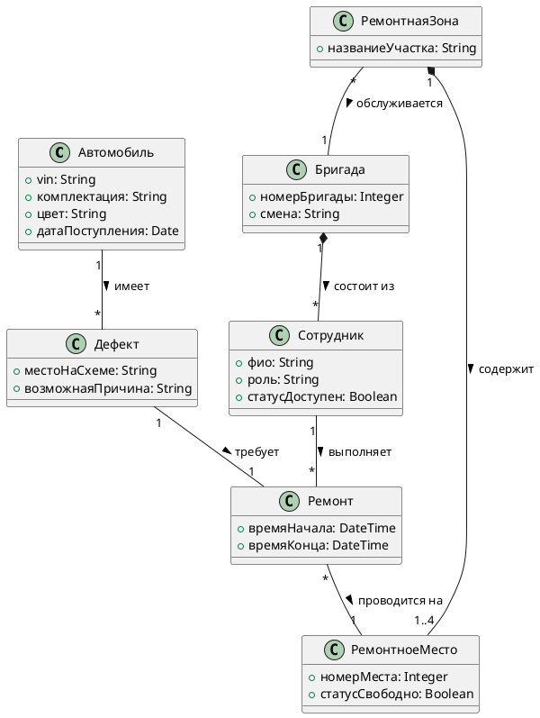
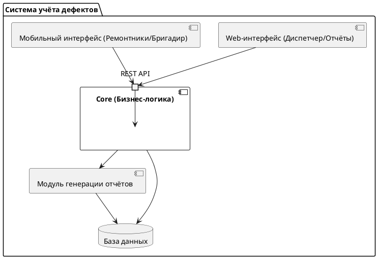
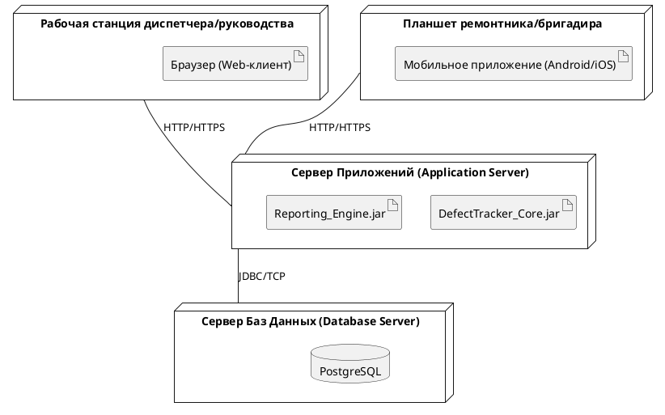
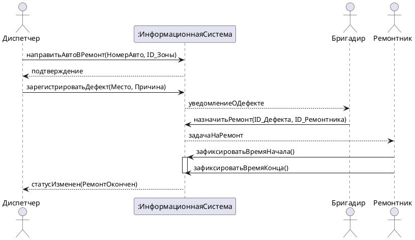
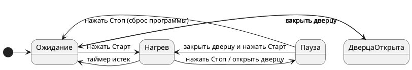
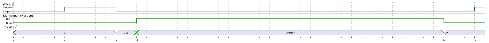

# Модели системы учёта дефектов и поведения микроволновой печи

## 1. Диаграмма прецедентов (Use Case)
Описывает пользователей и случаи использования разрабатываемого приложения.

**Пояснение:**

* Система должна обладать возможностью вносить данные о ремонтных зонах, местах и бригадах.

* Диспетчер должен иметь возможность видеть свободные места и направлять автомобили для ремонта в свободную ремонтную зону.

* Бригадир имеет возможность назначить ремонт конкретному рабочему.

* Рабочий может зарегистрироваться в системе как доступный и зафиксировать время начала и конца ремонта.

* Различные отделы получают специфические отчёты: отдел контроля качества получает сводный отчёт по участкам , начальник цеха — отчёт об общем количестве ремонтов , бригадир — статистику по своей бригаде , а бухгалтерия — отчёт об отработанных сменах.

---

## 2. Диаграмма активностей (Activity Diagram)

Описывает основной бизнес-процесс, поддерживаемый приложением — регистрацию и ремонт дефекта.

**Пояснение:**

* В случае обнаружения дефекта автомобиль снимается с конвейера и отправляется в ремонтную зону.

* Диспетчер направляет автомобиль для ремонта в свободную ремонтную зону.

* Дефект регистрируется после поступления автомобиля в ремонтную зону и выполнения первоначальной диагностики.

* После устранения дефекта автомобиль возвращается на конвейер либо в зону тестирования.

---

## 3. BPMN-диаграмма (Бизнес-процесс завода)

BPMN-диаграмма для всего бизнес-процесса завода, включая внешних его участников. В PlantUML для этого используются дорожки (swimlanes) диаграммы активности.

**Пояснение:**

* Завод получает набор заказов от дилеров.

* Отдел планирования составляет производственный план.

* Процесс производства включает сборку кузова, покраску и сборку остальных комплектующих.

* В отделе контроля качества автомобиль проходит серию стендовых и ходовых испытаний.

* В случае успешного прохождения проверок автомобиль отгружается заказчику.

---

## 4. Диаграмма классов (Class Diagram)

Диаграмма классов, моделирующая данные, хранимые системой.

**Пояснение:**

* Система хранит данные о ремонтных зонах, ремонтных местах, ремонтных бригадах и их бригадирах.

* Каждый участок конвейера имеет несколько (от одной до четырёх) ремонтных зон, в каждой зоне имеется несколько ремонтных мест.

* Каждая ремонтная зона обслуживается ремонтной бригадой, имеющей бригадира и нескольких ремонтников.

* При регистрации дефекта указывается место дефекта на схеме, возможная причина, номер автомобиля, дата поступления и выполнявший диагностику ремонтник.

---

## 5. Диаграмма компонентов (Component Diagram)

Диаграмма компонентов требуемой системы.

---

## 6. Диаграмма развёртывания (Deployment Diagram)

Диаграмма развёртывания с указанием компонентов, разворачиваемых на узле.

---

## 7. Диаграмма последовательностей (Sequence Diagram)

Диаграмма последовательностей регистрации и ремонта дефекта.

---

## 8. Диаграмма конечных автоматов (State Machine Diagram)

Диаграмма конечных автоматов, описывающая поведение микроволновки.

---

## 9. Временная диаграмма (Timing Diagram)

Временная диаграмма любого сценария работы микроволновки.

